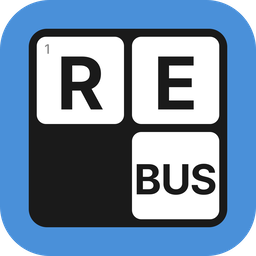

<h1 align="center">
  <br>
  
  <br>
  Rebus
  <br>
</h1>

A native desktop crossword puzzle solver for serious solvers. Supports `.puz`, `.ipuz`, and `.jpz` formats. Configurable navigation, dark mode, and more. Works fully offline.

Built with Tauri v2 (Rust + system WebView), React 19, TypeScript, and HTML5 Canvas.

## Download

Grab the latest installer from the **Releases** page on GitHub (sidebar or Releases tab).

| Platform | File |
|---|---|
| macOS (Apple Silicon) | `Rebus_x.x.x_aarch64.dmg` |
| macOS (Intel) | `Rebus_x.x.x_x64.dmg` |
| Windows | `Rebus_x.x.x_x64-setup.exe` or `Rebus_x.x.x_x64_en-US.msi` |

### macOS — security warning

Rebus is not code-signed. On first launch macOS will block it with an "unidentified developer" warning.

To open it anyway:

1. Right-click (or Control-click) the `.app` and choose **Open**
2. Click **Open** in the confirmation dialog

Alternatively, after the first blocked attempt go to **System Settings → Privacy & Security** and click **Open Anyway**.

### Windows — security warning

Rebus is not code-signed. Windows SmartScreen may show a "Windows protected your PC" warning.

To open it anyway:

1. Click **More info**
2. Click **Run anyway**

## Building from source

Requires Rust (stable) and Node.js (LTS).

```bash
npm install
npm run tauri dev
```

See [CLAUDE.md](CLAUDE.md) for the full development guide, project structure, and testing instructions.
